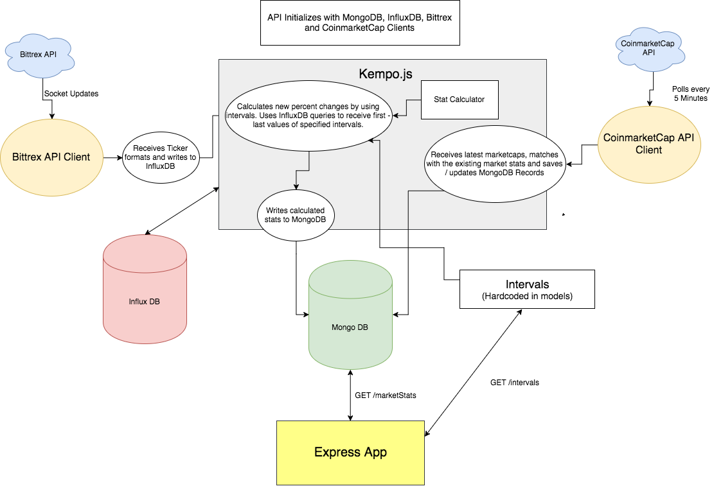

# cryptostats api

## Developer Guide
Make sure you've installed Docker.

```
$ git clone git@github.com:barbar/cryptostats.git

# Development
$ make dev

# Production
$ make prod
```

## Documentation

### Listening Socket Updates from Bittrex API
Cryptostats API uses [the socket part of Bittrex public API](https://bittrex.com/home/api) with [node.bittrex.api](https://github.com/dparlevliet/node.bittrex.api) package to receive the changes between currencies in real time. 

Each [socket update that has a ticker in its payload](https://github.com/barbar/cryptostats/blob/master/api/src/utils/bittrex.js) triggers the main controller of the app to perform operations like [writing ticker to Influx DB](https://github.com/barbar/cryptostats/blob/master/api/src/kempo.js#L53-L63) in a [well formatted way](https://github.com/barbar/cryptostats/blob/master/api/src/models/marketSummary.js), [calculating the relations between two cryptocurrencies](https://github.com/barbar/cryptostats/blob/master/api/src/kempo.js#L75-L87) with [given intervals](https://github.com/barbar/cryptostats/blob/master/api/src/models/intervals.js) and [updating the marketStats model stored in MongoDB](https://github.com/barbar/cryptostats/blob/master/api/src/kempo.js#L105-L128).

### Polling CoinmarketCap API
There's also a part that polls the [CoinmarketCap API](https://coinmarketcap.com/api/) to [receive latest value of market caps of various cryptocurrencies](https://github.com/barbar/cryptostats/blob/master/api/src/utils/coinMarketCap.js) and [updating the marketStat model with received values](https://github.com/barbar/cryptostats/blob/master/api/src/kempo.js#L130-L154).

### Diagram

